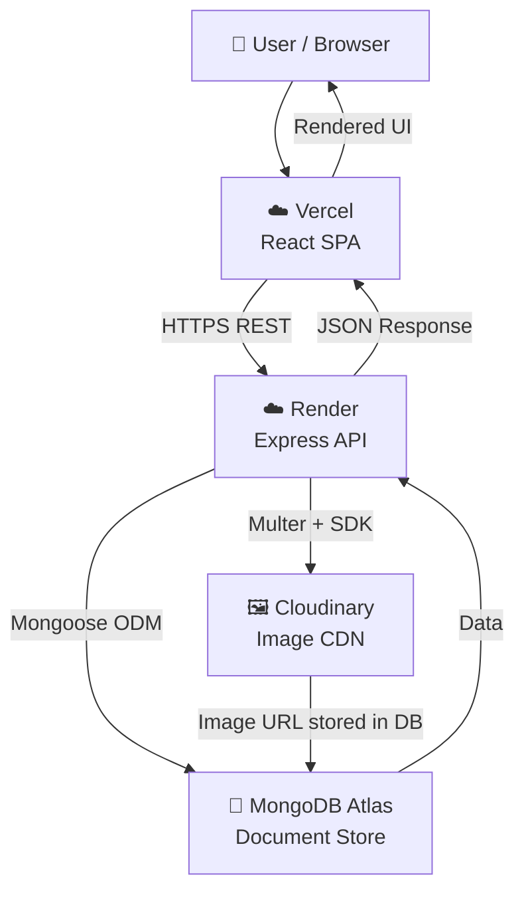

<div align="center">

# 🎬 FOMO Cinema

### A Movie Ticket Booking Platform

*Browse movies, book seats, leave reviews — all in one place.*

[](https://fomo-cinema.vercel.app)
[](https://fomo-cinema.onrender.com)
[](https://react.dev)
[](https://nodejs.org)
[](https://mongodb.com/atlas)
[](LICENSE)

</div>

---

## 📋 Table of Contents

- [Overview](#-overview)
- [Live Demo](#-live-demo)
- [Screenshots](#-screenshots)
- [Features](#-features)
- [Tech Stack](#-tech-stack)
- [Architecture](#-architecture)
- [Folder Structure](#-folder-structure)
- [Installation](#-installation)
- [Environment Variables](#-environment-variables)
- [Available Scripts](#-available-scripts)
- [Authentication Flow](#-authentication-flow)
- [Database Design](#-database-design)
- [API Documentation](#-api-documentation)
- [Cloudinary Integration](#-cloudinary-integration)
- [Review System](#-review-system)
- [Booking Flow](#-booking-flow)
- [Admin Dashboard](#-admin-dashboard)
- [Deployment Guide](#-deployment-guide)
- [Future Enhancements](#-future-enhancements)
- [Author](#-author)

---

## 🌟 Overview

**FOMO Cinema** is a production-ready, full-stack cinema booking platform built as a summer internship project. It lets users browse currently-showing and upcoming movies, select showtimes, pick seats interactively, complete bookings, and leave verified reviews — all backed by a secure REST API.

The project was built to demonstrate real-world full-stack engineering: a React SPA communicates with an Express/Node.js backend, persists data in MongoDB Atlas, stores media on Cloudinary, and secures every action with JWT-based role-based access control.

**Key objectives:**
- Design a complete user journey from discovery → booking → review
- Build a production-grade backend with proper authentication, validation, and error handling
- Provide administrators with a full management dashboard
- Deploy both services to cloud platforms with zero-downtime configuration

---

## 🔗 Live Demo

| Service | URL |
|---|---|
| 🌐 Frontend (Vercel) | [https://fomo-cinema.vercel.app](https://fomo-cinema.vercel.app) |
| ⚙️ Backend (Render) | [https://fomo-cinema.onrender.com](https://fomo-cinema.onrender.com) |
| 📡 API Base URL | `https://fomo-cinema.onrender.com/api` |

> **Note:** The Render backend runs on a free tier. On the first request after a period of inactivity it may take 30–60 seconds to wake up (cold start). Subsequent requests are fast.

---

## ✨ Features

### 👤 User Features

| Feature | Description |
|---|---|
| 🔐 **Registration & Login** | Secure sign-up with name, email, phone, and password. JWT-based session. |
| 🎬 **Movie Browsing** | Browse all currently-showing movies with poster, genres, duration, rating, and cast. |
| 📅 **Upcoming Movies** | Dedicated page for upcoming releases with full details. |
| 🔍 **Film by Day** | Filter currently-showing movies by day of the week. |
| 🎞️ **Movie Details** | Deep-dive page: IMDb rating, release date, trailer link, cast, description, and approved reviews. |
| 🎟️ **Interactive Seat Selection** | Visual seat map with Standard, Recliner, and Couple (Share) seat types. Sold seats shown in real time. |
| ✅ **Booking** | Book one or more seats for a chosen show in a single transaction. |
| 📋 **My Bookings** | View all personal bookings (active and cancelled) with full snapshot details. |
| ❌ **Booking Cancellation** | Cancel an active booking from the My Bookings page. |
| ⭐ **Leave a Review** | After attending a show, users can submit a 1–5 star rating and written review tied to their booking. |
| 📬 **Contact Form** | General enquiry form stored in the database. |
| 🏢 **Group Booking Request** | Corporate group booking enquiry form with company name and head-count. |

### 🛡️ Admin Features

| Feature | Description |
|---|---|
| 📊 **Dashboard Stats** | At-a-glance totals: users, movies, shows, bookings, reviews. |
| 🎬 **Movie Management** | Full CRUD — create, edit, archive, restore movies with Cloudinary image upload. |
| 📦 **Archive / Restore** | Soft-delete movies without losing historical booking data; restore any time. |
| 📅 **Show Management** | Create, edit, and delete show sessions with IST-aware datetime handling. |
| 🎫 **Booking Oversight** | View all bookings across all users. |
| 👥 **User Management** | View all registered users and their roles. |
| ⭐ **Review Moderation** | Approve, reject, or delete user reviews before they appear publicly. |
| 🖼️ **Cloudinary Uploads** | Upload movie poster images directly to Cloudinary from the admin UI. |

### 🔒 Security Features

| Feature | Implementation |
|---|---|
| 🔑 **JWT Authentication** | Signed tokens with `jsonwebtoken`; stored client-side in `localStorage`. |
| 🔐 **Password Hashing** | `bcryptjs` with salt rounds before storage; plaintext never persisted. |
| 👮 **Role-Based Access** | `user` / `admin` roles enforced by dedicated middleware on every protected route. |
| 🪖 **Helmet** | Sets security-related HTTP response headers automatically. |
| 🌐 **CORS** | Whitelist-only origin policy with explicit preflight (`OPTIONS`) handling. |
| 🚦 **Rate Limiting** | 200 requests per IP per 15 minutes on all `/api` routes via `express-rate-limit`. |
| ✅ **Input Validation** | `express-validator` rules on all mutation endpoints (register, login, booking, review, contact). |

---

## 🛠️ Tech Stack

### Frontend

| Technology | Version | Purpose |
|---|---|---|
| React | 19 | UI library |
| React Router DOM | 7 | Client-side routing |
| Tailwind CSS | 4 | Utility-first styling |
| Framer Motion | 12 | Animations and transitions |
| Swiper | 12 | Hero and movie carousels |
| Lucide React | 1 | Icon library |
| React Phone Input 2 | 2 | International phone input |
| Vite | 8 | Build tool and dev server |

### Backend

| Technology | Version | Purpose |
|---|---|---|
| Node.js | ≥18 | Runtime |
| Express | 4 | Web framework |
| Mongoose | 7 | MongoDB ODM |
| jsonwebtoken | 9 | JWT issuance and verification |
| bcryptjs | 2 | Password hashing |
| express-validator | 7 | Request validation |
| Helmet | 7 | Security headers |
| CORS | 2 | Cross-origin resource sharing |
| express-rate-limit | 7 | API rate limiting |
| Multer | 2 | Multipart/form-data parsing |
| multer-storage-cloudinary | 4 | Cloudinary storage engine for Multer |
| Morgan | 1 | HTTP request logging (dev only) |
| Dotenv | 16 | Environment variable loading |
| Nodemon | 3 | Auto-restart in development |

### Infrastructure

| Service | Purpose |
|---|---|
| MongoDB Atlas | Cloud-hosted NoSQL database |
| Cloudinary | Cloud image storage and delivery |
| Vercel | Frontend hosting with SPA rewrite rules |
| Render | Backend hosting with auto-deploy from Git |

---

## 🏗️ Architecture



**Request lifecycle:**
1. React SPA makes `fetch()` calls to `https://fomo-cinema.onrender.com/api`
2. CORS middleware validates the origin; Helmet sets security headers
3. Rate limiter checks the request budget for the IP
4. `authMiddleware` (and `adminMiddleware` where required) verify the JWT
5. Controller queries MongoDB via Mongoose models
6. JSON response returns to the frontend

---

## 📁 Folder Structure

```
Fomo-Cinema/
├── Frontend/                         # React + Vite SPA
│   ├── public/                       # Static public assets
│   ├── src/
│   │   ├── assets/                   # Local movie poster images (movie1.jpg … movie26.jpg)
│   │   ├── components/               # Shared UI components
│   │   │   ├── AdminProtectedRoute.jsx
│   │   │   ├── Footer.jsx
│   │   │   ├── HeroSlider.jsx
│   │   │   ├── MovieCard.jsx
│   │   │   ├── MovieDetails.jsx
│   │   │   ├── MovieSection.jsx
│   │   │   ├── Navbar.jsx
│   │   │   └── ProtectedRoute.jsx
│   │   ├── context/
│   │   │   ├── AuthContext.jsx       # Global auth state (user, token, login/logout)
│   │   │   └── ToastContext.jsx      # Global toast notification system
│   │   ├── data/
│   │   │   └── menuData.js           # Static food & drinks menu data
│   │   ├── pages/
│   │   │   ├── admin/
│   │   │   │   ├── AdminBookings.jsx
│   │   │   │   ├── AdminDashboard.jsx
│   │   │   │   ├── AdminLayout.jsx
│   │   │   │   ├── AdminMovies.jsx
│   │   │   │   ├── AdminReviews.jsx
│   │   │   │   ├── AdminShows.jsx
│   │   │   │   └── AdminUsers.jsx
│   │   │   ├── About.jsx
│   │   │   ├── Booking.jsx           # Interactive seat selection + booking confirmation
│   │   │   ├── Contact.jsx
│   │   │   ├── FAQs.jsx
│   │   │   ├── FilmByDay.jsx
│   │   │   ├── FoodDetails.jsx
│   │   │   ├── FoodDrinks.jsx
│   │   │   ├── GroupBooking.jsx
│   │   │   ├── Home.jsx
│   │   │   ├── LoginSidebar.jsx      # Slide-in login / register panel
│   │   │   ├── Memberships.jsx
│   │   │   ├── MyBookings.jsx
│   │   │   ├── Offers.jsx
│   │   │   ├── Privacy.jsx
│   │   │   ├── Terms.jsx
│   │   │   ├── UpcomingMoviesDetails.jsx
│   │   │   └── UpcomingShows.jsx
│   │   ├── services/
│   │   │   └── api.js                # All fetch() service functions + ApiError class
│   │   ├── utils/
│   │   │   └── dateUtils.js          # Date formatting helpers
│   │   ├── App.jsx                   # Route definitions
│   │   ├── index.css
│   │   └── main.jsx
│   ├── .env                          # VITE_API_URL
│   ├── vercel.json                   # SPA rewrite rules
│   ├── vite.config.js
│   └── package.json
│
└── Backend/                          # Node.js + Express API
    ├── src/
    │   ├── config/
    │   │   ├── cloudinary.js         # Cloudinary SDK configuration
    │   │   └── db.js                 # MongoDB Atlas connection
    │   ├── controllers/
    │   │   ├── adminController.js    # Stats, users, movies CRUD, shows CRUD, bookings
    │   │   ├── authController.js     # register, login, getMe
    │   │   ├── bookingController.js  # createBooking, getMyBookings, cancelBooking
    │   │   ├── contactController.js
    │   │   ├── groupBookingController.js
    │   │   ├── movieController.js    # getMovies, getUpcoming, getById, getByDay
    │   │   ├── reviewController.js   # create, getMovieReviews, footer, admin moderation
    │   │   ├── showController.js     # getShows, getById, getByMovie, findShow
    │   │   └── uploadController.js   # Cloudinary image upload
    │   ├── middleware/
    │   │   ├── adminMiddleware.js    # Require role === "admin"
    │   │   ├── authMiddleware.js     # Verify JWT, attach req.user
    │   │   ├── errorMiddleware.js    # Centralised error handler
    │   │   ├── securityMiddleware.js # Helmet + CORS + Rate Limiting
    │   │   └── uploadMiddleware.js   # Multer + Cloudinary storage engine
    │   ├── models/
    │   │   ├── Booking.js
    │   │   ├── Contact.js
    │   │   ├── GroupBookingRequest.js
    │   │   ├── Movie.js
    │   │   ├── Review.js
    │   │   ├── Show.js
    │   │   └── User.js
    │   ├── routes/
    │   │   ├── adminRoutes.js
    │   │   ├── authRoutes.js
    │   │   ├── bookingRoutes.js
    │   │   ├── contactRoutes.js
    │   │   ├── groupBookingRoutes.js
    │   │   ├── healthRoutes.js
    │   │   ├── movieRoutes.js
    │   │   ├── reviewRoutes.js
    │   │   ├── showRoutes.js
    │   │   └── uploadRoutes.js
    │   ├── utils/
    │   │   ├── bookingIdGenerator.js # Generates unique human-readable booking IDs
    │   │   ├── checkAdmin.js         # Verify admin exists in the database
    │   │   ├── checkBookings.js      # Diagnostic script for booking integrity
    │   │   ├── createAdmin.js        # Idempotent admin account creation
    │   │   ├── migrateSeededMovies.js
    │   │   ├── movieStatusMap.js     # Maps movie IDs to status (now-showing / upcoming)
    │   │   ├── seed.js               # Seeds movies and shows from static data
    │   │   └── testEndpoints.js      # Quick endpoint smoke test
    │   ├── validators/
    │   │   ├── authValidator.js
    │   │   ├── bookingValidator.js
    │   │   ├── contactValidator.js
    │   │   └── reviewValidator.js
    │   ├── app.js                    # Express app setup (middleware + routes)
    │   └── server.js                 # Entry point: DB connect + HTTP listen
    ├── .env                          # Backend secrets (never committed)
    └── package.json
```

---

## 🚀 Installation

### Prerequisites

- Node.js ≥ 18
- npm ≥ 9
- A [MongoDB Atlas](https://mongodb.com/atlas) cluster
- A [Cloudinary](https://cloudinary.com) account

### 1. Clone the Repository

```bash
git clone https://github.com/VrajPanchal10/Fomo-Cinema.git
cd Fomo-Cinema
```

### 2. Install Backend Dependencies

```bash
cd Backend
npm install
```

### 3. Install Frontend Dependencies

```bash
cd ../Frontend
npm install
```

### 4. Configure Environment Variables

```bash
# Backend — copy the example and fill in your credentials
cp Backend/.env.example Backend/.env

# Frontend — set VITE_API_URL to your backend URL
cp Frontend/.env.example Frontend/.env
```

### 5. Run the Backend

```bash
cd Backend
npm run dev      # Development with auto-reload (nodemon)
# or
npm start        # Production
```

The API will be available at `http://localhost:5001`.

### 6. Run the Frontend

```bash
cd Frontend
npm run dev
```

The SPA will be available at `http://localhost:5173`.

### 7. Seed the Database

Populate movies and shows with sample data:

```bash
cd Backend
npm run seed
```

### 8. Create the Admin Account

```bash
cd Backend
npm run create:admin
```

This reads `ADMIN_NAME`, `ADMIN_EMAIL`, `ADMIN_PASSWORD`, and `ADMIN_PHONE` from `.env`. The script is **idempotent** — safe to run multiple times.

---

## 🔑 Environment Variables

### Backend — `Backend/.env`

```env
# ── Server ──────────────────────────────────
PORT=5001
NODE_ENV=development

# ── Database ────────────────────────────────
MONGODB_URI=mongodb+srv://<user>:<password>@<cluster>.mongodb.net/<dbname>?retryWrites=true&w=majority

# ── Authentication ───────────────────────────
JWT_SECRET=your_super_secret_jwt_key_here

# ── CORS ─────────────────────────────────────
# URL of the deployed (or local) frontend
CLIENT_URL=http://localhost:5173

# ── Cloudinary ───────────────────────────────
CLOUDINARY_CLOUD_NAME=your_cloud_name
CLOUDINARY_API_KEY=your_api_key
CLOUDINARY_API_SECRET=your_api_secret

# ── Admin Seed Account ────────────────────────
ADMIN_NAME=Fomo Administrator
ADMIN_EMAIL=admin@fomocinema.com
ADMIN_PHONE=0000000000
ADMIN_PASSWORD=your_strong_admin_password

# ── Optional ─────────────────────────────────
# Set to true to enable morgan request logging in terminal
DEBUG_API_LOGS=false
```

### Frontend — `Frontend/.env`

```env
# Must point to the running backend (local dev or Render URL)
VITE_API_URL=http://localhost:5001
```

> ⚠️ **Never commit `.env` files.** Both are listed in `.gitignore`.

---

## 📜 Available Scripts

### Backend (`cd Backend`)

| Command | Description |
|---|---|
| `npm run dev` | Start with Nodemon — auto-restarts on file changes (development) |
| `npm start` | Start the production server with plain Node.js |
| `npm run seed` | Seed the database with movies and scheduled shows |
| `npm run create:admin` | Create the admin account from `.env` credentials (idempotent) |
| `npm run check:admin` | Verify whether an admin account exists in the database |
| `npm run migrate:shows` | Migrate show documents to the current schema (one-time migration) |

### Frontend (`cd Frontend`)

| Command | Description |
|---|---|
| `npm run dev` | Start Vite development server with HMR |
| `npm run build` | Build the production bundle to `dist/` |
| `npm run preview` | Preview the production build locally |
| `npm run lint` | Run ESLint across all source files |

---

## 🔐 Authentication Flow

```
User fills Register form
        │
        ▼
POST /api/auth/register
  • express-validator validates name, email, phone, password
  • Password hashed with bcryptjs
  • User document saved to MongoDB
  • JWT signed and returned
        │
        ▼
Token stored in localStorage
        │
        ▼
User fills Login form
        │
        ▼
POST /api/auth/login
  • Credentials validated
  • bcrypt.compare() checks password hash
  • New JWT signed and returned
        │
        ▼
Subsequent requests → Authorization: Bearer <token>
        │
        ▼
authMiddleware verifies token → attaches req.user
        │
        ├──► Regular user routes (bookings, reviews)
        │
        └──► adminMiddleware checks role === "admin"
                   │
                   ▼
             Admin dashboard routes
```

**Why is admin creation a CLI script?**

Admin accounts are not creatable through the public API. Exposing a `/api/auth/register-admin` endpoint would allow anyone to grant themselves admin privileges. Instead, `npm run create:admin` reads credentials from the server's `.env` file — a file only accessible to the server operator — and sets `role: "admin"` directly in the database.

---

## 🗄️ Database Design

Seven MongoDB collections power the platform:

| Collection | Key Fields | Purpose |
|---|---|---|
| **users** | `name`, `email`, `password`, `phone`, `role` | Registered accounts; role is `"user"` or `"admin"` |
| **movies** | `title`, `genre[]`, `status`, `isActive`, `deletedAt`, `averageRating`, `reviewCount` | Movie catalogue; supports soft-delete archive |
| **shows** | `movie` (ref), `showDateTime`, `ticketPrice`, `screenName`, `bookedSeats[]`, `seatConfiguration`, `status` | Show sessions; virtuals derive `showDate`, `showTime`, `weekday` in IST |
| **bookings** | `user`, `show`, `movie`, `selectedSeats[]`, `bookingId`, `bookingStatus`, snapshot fields | Immutable booking receipt; snapshot preserves data independent of future edits |
| **reviews** | `user`, `movie`, `booking` (unique), `rating`, `review`, `status` | User reviews gated behind a booking; one per booking |
| **contacts** | `name`, `email`, `phone`, `subject`, `message` | General enquiry submissions |
| **groupbookingrequests** | `companyName`, `numberOfPeople`, `message`, `status` | Corporate group enquiries |

**Key design decisions:**

- **Booking snapshot** — `movieTitle`, `showDateLabel`, `showTimeLabel`, `screenName`, and `ticketPrice` are copied into the booking document at creation. Historical receipts remain accurate even if the Movie or Show is later edited.
- **Soft delete for movies** — `isActive` and `deletedAt` allow archiving without cascading deletes. Archived movies are invisible to users but their booking records are intact.
- **IST virtuals** — `Show.showDate`, `Show.showTime`, and `Show.weekday` are computed from the single UTC `showDateTime` field using IST (UTC+5:30) arithmetic, eliminating redundant stored fields.
- **Review gate** — The `booking` field on a review has a `unique` index, so each booking can produce at most one review.

---

## 📡 API Documentation

All routes are prefixed with `/api`. Authentication is Bearer JWT.

### Auth — `/api/auth`

| Method | Endpoint | Description | Auth |
|---|---|---|---|
| `POST` | `/auth/register` | Register a new user | ❌ |
| `POST` | `/auth/login` | Log in and receive JWT | ❌ |
| `GET` | `/auth/me` | Get the current authenticated user | ✅ User |

### Movies — `/api/movies`

| Method | Endpoint | Description | Auth |
|---|---|---|---|
| `GET` | `/movies` | Get all active now-showing movies | ❌ |
| `GET` | `/movies/upcoming` | Get all active upcoming movies | ❌ |
| `GET` | `/movies/film-by-day/:day` | Get movies showing on a specific weekday | ❌ |
| `GET` | `/movies/:id` | Get a single movie by its numeric ID | ❌ |

### Shows — `/api/shows`

| Method | Endpoint | Description | Auth |
|---|---|---|---|
| `GET` | `/shows` | Get all shows | ❌ |
| `GET` | `/shows/find?movieId=&date=&time=` | Find a show by movie, date, and time | ❌ |
| `GET` | `/shows/movie/:movieId` | Get all shows for a specific movie | ❌ |
| `GET` | `/shows/:id` | Get a single show by ID | ❌ |

### Bookings — `/api/bookings`

| Method | Endpoint | Description | Auth |
|---|---|---|---|
| `POST` | `/bookings` | Create a new booking | ✅ User |
| `GET` | `/bookings/my-bookings` | Get all bookings for the current user | ✅ User |
| `GET` | `/bookings/:id` | Get a single booking by ID | ✅ User |
| `PATCH` | `/bookings/:id/cancel` | Cancel an active booking | ✅ User |

### Reviews — `/api/reviews`

| Method | Endpoint | Description | Auth |
|---|---|---|---|
| `GET` | `/reviews/footer` | Get approved reviews for the footer carousel | ❌ |
| `GET` | `/reviews/movie/:movieId` | Get all approved reviews for a movie | ❌ |
| `POST` | `/reviews` | Submit a new review (requires a booking) | ✅ User |

### Contact — `/api/contact`

| Method | Endpoint | Description | Auth |
|---|---|---|---|
| `POST` | `/contact` | Submit a general enquiry | ❌ |

### Group Booking — `/api/group-booking`

| Method | Endpoint | Description | Auth |
|---|---|---|---|
| `POST` | `/group-booking` | Submit a corporate group booking enquiry | ❌ |

### Upload — `/api/upload`

| Method | Endpoint | Description | Auth |
|---|---|---|---|
| `POST` | `/upload/image?type=posters` | Upload a movie poster image to Cloudinary | ✅ Admin |

### Health — `/api/health`

| Method | Endpoint | Description | Auth |
|---|---|---|---|
| `GET` | `/health` | Health check endpoint | ❌ |

### Admin — `/api/admin` *(all routes require Admin JWT)*

| Method | Endpoint | Description |
|---|---|---|
| `GET` | `/admin/stats` | Platform summary statistics |
| `GET` | `/admin/users` | List all registered users |
| `GET` | `/admin/movies` | List all active movies |
| `GET` | `/admin/movies/archived` | List all archived movies |
| `POST` | `/admin/movies` | Create a new movie |
| `PUT` | `/admin/movies/:id` | Update a movie |
| `PATCH` | `/admin/movies/:id/archive` | Soft-delete (archive) a movie |
| `PATCH` | `/admin/movies/:id/restore` | Restore an archived movie |
| `GET` | `/admin/shows` | List all shows |
| `POST` | `/admin/shows` | Create a new show |
| `PUT` | `/admin/shows/:id` | Update a show |
| `DELETE` | `/admin/shows/:id` | Delete a show |
| `GET` | `/admin/bookings` | List all bookings across all users |
| `GET` | `/admin/reviews` | List all reviews (filterable by status/search) |
| `PATCH` | `/admin/reviews/:id/approve` | Approve a pending review |
| `PATCH` | `/admin/reviews/:id/reject` | Reject a review |
| `DELETE` | `/admin/reviews/:id` | Permanently delete a review |

---

## 🖼️ Cloudinary Integration

Movie poster images are stored and served through Cloudinary:

```
Admin selects an image file in the Admin UI
               │
               ▼
POST /api/upload/image  (multipart/form-data)
               │
               ▼
uploadMiddleware (Multer + multer-storage-cloudinary)
  • Validates file type and size
  • Streams file directly to Cloudinary
               │
               ▼
Cloudinary returns a secure HTTPS URL
               │
               ▼
URL saved to Movie.poster field in MongoDB
               │
               ▼
Frontend renders  directly
```

The `getMovieImage()` helper in `api.js` handles both storage modes transparently:
- If `poster` starts with `https://` → Cloudinary URL, used directly
- If `poster` is a bare filename like `movie1.jpg` → resolved from the local bundled image map

---

## ⭐ Review System

Reviews are protected behind a booking gate to prevent spam:

```
User completes a booking  (bookingStatus: "active")
               │
               ▼
My Bookings page shows a "Leave Review" option
               │
               ▼
POST /api/reviews
  • authMiddleware confirms the user is logged in
  • reviewValidator ensures rating (1–5) and review text (10–1000 chars)
  • Controller checks the booking exists and belongs to this user
  • Unique index on Review.booking → one review per booking maximum
  • Review saved with  status: "pending"
               │
               ▼
Admin sees the review in the Review Moderation panel
               │
         ┌─────┴──────┐
         ▼            ▼
     Approve        Reject
         │
         ▼
  status: "approved"
         │
         ▼
Review appears publicly on Movie Details page
and in the footer review carousel
```

---

## 🎟️ Booking Flow

```
User browses Home page or Film by Day
               │
               ▼
Clicks on a movie → Movie Details page
  • Shows info: IMDb rating, cast, genres, duration, approved reviews
               │
               ▼
Selects a showtime from available sessions
               │
               ▼
Booking page loads  (/booking/:showId)
  • Fetches real-time seat map from the show document
  • Seat types: Standard | Recliner | Couple
  • Already-booked seats (bookedSeats[]) shown as unavailable
               │
               ▼
User selects available seats → "Confirm Booking"
               │
               ▼
POST /api/bookings
  • authMiddleware ensures user is logged in
  • bookingValidator validates showId and selectedSeats
  • Controller checks seats are still available
  • Unique booking ID generated  (e.g. FC-20260627-A3X2)
  • Snapshot of show/movie data saved to the booking document
  • Show.bookedSeats updated atomically
               │
               ▼
Booking confirmation displayed
               │
               ▼
Booking visible in My Bookings with full receipt details
```

---

## 🛡️ Admin Dashboard

The admin panel lives at `/admin` and is protected by both `authMiddleware` and `adminMiddleware`. Admin accounts can only be created via `npm run create:admin`.

| Module | Capabilities |
|---|---|
| **Dashboard** | View total counts: users, movies, shows, bookings, reviews |
| **Movies** | Create / edit / archive / restore movies; upload Cloudinary poster images; toggle between active and archived lists |
| **Shows** | Create, edit, and delete shows with IST datetime handling; view current show status (Scheduled, Active, Sold Out, Completed, Cancelled, Archived) |
| **Bookings** | Read-only view of all bookings across all users including seat selection and snapshot details |
| **Users** | Read-only list of all registered users with role and registration date |
| **Reviews** | Filter by status (pending / approved / rejected) and search; approve, reject, or permanently delete |

---

## ☁️ Deployment Guide

### MongoDB Atlas

1. Create a free cluster at [mongodb.com/atlas](https://mongodb.com/atlas)
2. Add a database user with read/write access
3. Whitelist `0.0.0.0/0` (all IPs) — or the specific Render outbound IP
4. Copy the connection string → set as `MONGODB_URI` in Render

### Cloudinary

1. Create a free account at [cloudinary.com](https://cloudinary.com)
2. Copy **Cloud Name**, **API Key**, **API Secret** from the dashboard
3. Set as `CLOUDINARY_CLOUD_NAME`, `CLOUDINARY_API_KEY`, `CLOUDINARY_API_SECRET` in Render

### Backend — Render

1. Create a new **Web Service** on [render.com](https://render.com)
2. Connect your GitHub repository; set **Root Directory** to `Backend`
3. **Build Command:** `npm install`
4. **Start Command:** `npm start`
5. Add all backend `.env` variables under **Environment**
6. Set `NODE_ENV=production` and `CLIENT_URL=https://fomo-cinema.vercel.app`
7. Render auto-deploys on every push to `main`

### Frontend — Vercel

1. Create a new project on [vercel.com](https://vercel.com)
2. Connect your GitHub repository; set **Root Directory** to `Frontend`
3. **Framework Preset:** Vite
4. Add `VITE_API_URL=https://fomo-cinema.onrender.com` under **Environment Variables**
5. The `vercel.json` in `Frontend/` handles SPA routing — all paths rewrite to `index.html`
6. Vercel auto-deploys on every push to `main`

---

## 🔮 Future Enhancements

| Enhancement | Description |
|---|---|
| 💳 **Payment Gateway** | Integrate Stripe or Razorpay for real ticket payments before booking confirmation |
| 📧 **Email Notifications** | Send booking confirmation and cancellation emails via Nodemailer or SendGrid |
| 📱 **QR Code Tickets** | Generate a scannable QR code per booking for in-cinema verification |
| 🔔 **Push Notifications** | Notify users of upcoming shows or new releases via Web Push API |
| 🎭 **Multi-Screen Support** | Support multiple halls per cinema with independent seat configurations |
| 🏷️ **Coupon & Promo System** | Discount codes redeemable at checkout |
| 🤖 **Recommendation Engine** | Suggest movies to users based on booking and review history |
| 📊 **Admin Analytics Charts** | Revenue graphs, popular movies, and seat occupancy rates in the admin dashboard |

---

## 👤 Author

<div align="center">

**Vraj Panchal**

[](https://github.com/VrajPanchal10)
[](https://www.linkedin.com/in/vraj-panchal-a9a104337/)

*Built with ❤️ during Summer Internship 2026*

</div>

---

<div align="center">

⭐ **If you found this project useful, please star the repository!** ⭐

</div>
